# Frontend Skill Map

Color in this diagram represents **proficiency status**, not topic/category.

```mermaid
flowchart LR
  root((Frontend Growth))

  js[JavaScript]
  react[React]
  arch[Architecture]
  realtime[Realtime]
  browser[Browser & Performance]
  ts[TypeScript]
  testing[Testing]
  next[Next.js]
  security[Security]
  a11y[Accessibility]

  root --> js
  root --> react
  root --> arch
  root --> realtime
  root --> browser
  root --> ts
  root --> testing
  root --> next
  root --> security
  root --> a11y

  js --> js_scope[Scope & Closures]
  js --> js_this[this / bind / call / apply]
  js --> js_proto[Prototype & Properties]
  js --> js_eq[Equality / Object.is]
  js --> js_coercion[Coercion]
  js --> js_event[Event Loop / Promises]

  react --> react_state[State Ownership]
  react --> react_render[Rendering & Reconciliation]
  react --> react_fiber[Fiber]
  react --> react_effects[Effects]
  react --> react_perf[Performance]
  react --> react_context[Context / Stores]
  react --> react_suspense[Suspense / RSC]

  arch --> arch_boundaries[Boundaries]
  arch --> arch_dip[Dependency Inversion]
  arch --> arch_events[Event-driven Trade-offs]
  arch --> arch_system[System Design]

  realtime --> rt_ws[WebSocket]
  realtime --> rt_snapshot[Snapshot + Delta]
  realtime --> rt_reconnect[Reconnect / Resync]
  realtime --> rt_ui[High-frequency UI]

  browser --> browser_pipeline[Rendering Pipeline]
  browser --> browser_layout[Layout / Paint]
  browser --> browser_inp[Long Tasks / INP]
  browser --> browser_worker[Web Workers]

  ts --> ts_union[Unions / Narrowing]
  ts --> ts_generics[Generics]
  ts --> ts_exhaustive[Exhaustiveness]

  testing --> testing_concepts[Concepts]
  testing --> testing_practical[Practical Experience]

  next --> next_ssr[SSR / RSC]
  next --> next_router[App Router]
  next --> next_cache[Caching / Revalidation]
  next --> next_bff[BFF]

  security --> security_core[XSS / CSRF / CSP]
  a11y --> a11y_core[Semantics / Forms / Modals]

  class js_scope,js_event,react_render,react_fiber,react_effects,react_suspense,testing_concepts,next_ssr,next_router,next_bff developing
  class js_this,js_proto,js_eq,js_coercion,testing_practical,next_cache gap
  class react_context,browser_pipeline,browser_layout,ts_union,ts_generics,ts_exhaustive,security_core,a11y_core good
  class react_state,react_perf,arch_boundaries,arch_dip,arch_events,arch_system,rt_ws,rt_snapshot,rt_reconnect,rt_ui,browser_inp,browser_worker strong

  classDef strong fill:#d5f5e3,stroke:#1e8449,color:#111,stroke-width:2px
  classDef good fill:#d6eaf8,stroke:#2874a6,color:#111,stroke-width:2px
  classDef developing fill:#fcf3cf,stroke:#b7950b,color:#111,stroke-width:2px
  classDef gap fill:#fadbd8,stroke:#c0392b,color:#111,stroke-width:2px
```

## Legend

- 🟢 **Strong** — repeatedly demonstrated applied reasoning.
- 🔵 **Good** — reliable conceptual/applied knowledge with some remaining depth.
- 🟡 **Developing** — recently learned or inconsistent; needs retest.
- 🔴 **Gap** — currently weak, unknown, or insufficiently demonstrated.

Category nodes such as `JavaScript`, `React`, and `Testing` use Mermaid's default styling. Only skill nodes are color-coded by proficiency.
