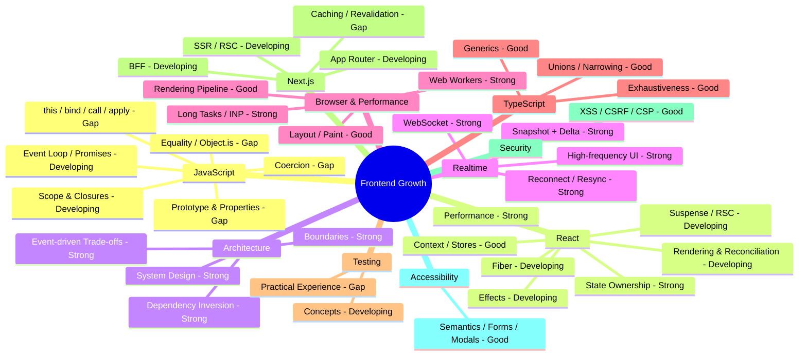

# Frontend Skill Map

Legend:

- Strong: repeatedly demonstrated applied reasoning.
- Good: reliable conceptual/applied knowledge with some remaining depth.
- Developing: recently learned or inconsistent; needs retest.
- Gap: currently weak, unknown, or insufficiently demonstrated.

> Note: Mermaid mindmap styling with custom `classDef` rules is not reliably supported by GitHub's renderer. Status is encoded in node labels to keep this diagram portable and renderable.
